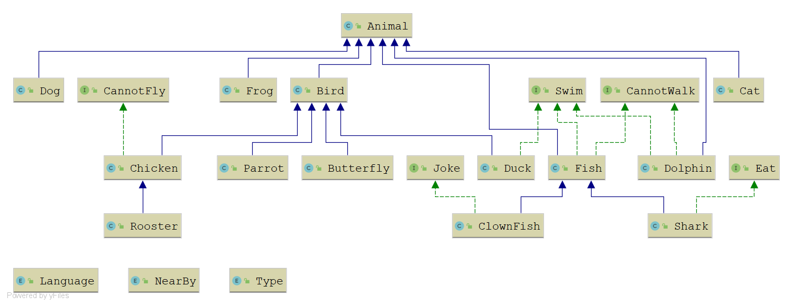

This is a Spirng boot application for implement different animal behaviours by inheriting common features from 
parents

Interface -:
 CannotFly.java
 CannotWalk.java
 Eat.java
 Joke.java
 Swim.java
 
 Concrete Classes -:
 Cat.java
 Dog.java
 Bird.java
 Butterfly.java
 Chicken.java
 Duck.java
 Parrot.java
 Rooster.java
 ClownFish.java
 Dolphin.java
 Fish.java
 Shark.java
 Animal.java
 Frog.java
 
 RestController -:
 Animal Rest Controller
 
 
 refer below diagram to understand the relation ships
